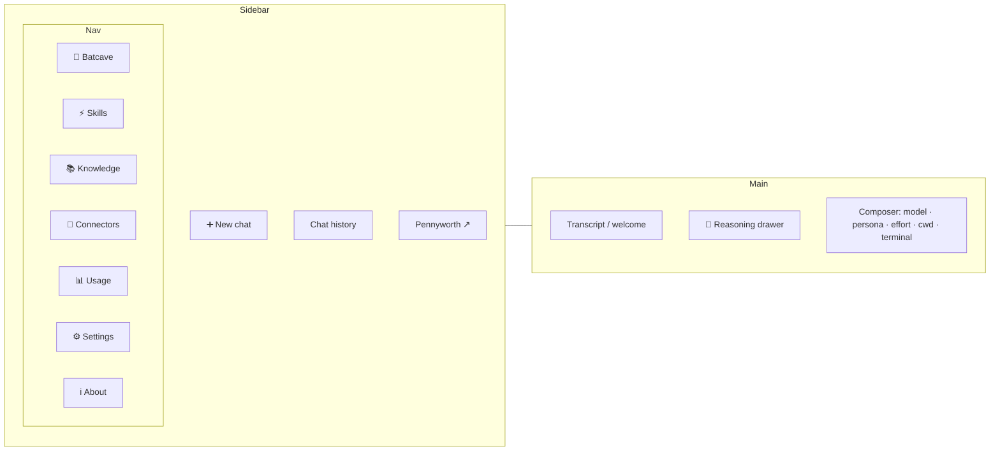

# The desktop app — a tour

Launch it with `alfred app` (or `poetry run alfred app` from a clone). This is a
guided tour of every part of the window.

> Screenshots are marked `📸`. To capture them yourself, see
> [the screenshot checklist](screenshots.md).

## Layout at a glance

📸 `images/app-overview.png` — the whole window, a chat in progress.

## Chat

The heart of the app. Type in plain language and Alfred streams his reply.

- **Streaming** — text appears token by token. Tool calls and sub-agents show as
  collapsible steps; extended thinking streams into the **🧠 reasoning drawer**
  (enable *Show thinking* in Settings).
- **Composer controls** (left → right): **model** picker (`auto` routes each
  request to the cheapest capable model), **persona**, **effort**
  (low/medium/high), **working directory**, and a **terminal** toggle.
- **Markdown** replies render fully — headings, lists, code blocks with copy
  buttons, and clickable links (opened in your browser, never navigating the
  app away).
- **Multi-chat** — each conversation in the sidebar keeps its own model, persona,
  working directory, and history. Conversations are saved and survive a restart.

📸 `images/chat-streaming.png` — a reply mid-stream with the reasoning drawer open.

## Embedded terminal

The **❯_ Terminal** button in the composer opens a real PTY shell, rooted at the
chat's working directory, right inside the pane — for the moments you'd rather
type a command than ask for one.

## 📚 Knowledge

Teach *this* Alfred about your domain. Every enabled entry is injected into his
prompt at the start of each turn — no code change, no pack. Add inline notes,
import a file, or link a file (re-read live each turn). Full guide:
**[Teach Alfred your domain](knowledge.md)**.

📸 `images/knowledge.png` — the Knowledge panel with a couple of entries.

## ⚡ Skills

Alfred's craft knowledge — reference docs that load automatically when a request
touches their topic (debugging, git, PR-writing, testing, investigation…).
Read-only in the open-source core; a pack can add its own.

## 🦇 Batcave

Your configured repositories at a glance — each one's branch and uncommitted
changes. Add repositories under **Settings → Repositories**; every configured
repo is also handed to Alfred as a working directory, so he can operate in it
directly. (No Docker/CI/deploy sections — those belong to a platform pack.)

📸 `images/batcave.png` — the Batcave listing a repo's git state.

## 🔌 Connectors

Manage MCP servers that give Alfred new "hands" (tools). Add by URL or command.

## 📊 Usage

Your Claude subscription quotas — the rolling 5-hour and 7-day windows with
percent-used and reset countdowns — read live from Anthropic via your signed-in
Claude CLI. (If `claude` isn't signed in, the panel says so.)

## ⏰ Scheduled

Prompts Alfred runs at a chosen time while the app is open — a quick way to queue
"review the diff at 5pm".

## ⚙️ Settings

- **Profile** — your name and how Alfred addresses you (sir/madam).
- **Defaults** — model, persona, effort, *show thinking*, notifications.
- **Appearance** — UI font (system/serif/mono), scale, and theme.
- **Repositories** — the repos Alfred works in and that appear in the Batcave.

📸 `images/settings.png` — the Settings panel.

## Themes

Beyond the built-in dark themes, create your own under Appearance: pick the
colours, save, and export/share/import theme JSON. Personas (Architect,
Speedster, Mentor, Hunter, PM, Dexter, Ultron) recolour a chat's accent.

## ℹ️ About

Version, the Alfred persona, capabilities, and credits.

## Keyboard

- **⌘N** — new chat
- **⌘+ / ⌘- / ⌘0** — UI scale up / down / reset
- **Enter** — send · **Shift-Enter** — newline

## Troubleshooting

- **Window opens but nothing responds** — fully quit (⌘Q) and relaunch; the app
  purges the WebKit cache on launch so a pulled update takes effect.
- **A panel shows an error or a turn fails** — the desktop console isn't visible,
  so errors are logged to `~/.pennyworth/app/diag.log`; share that when reporting
  a bug.
- **"Usage" is empty** — sign in with `claude auth login`.
