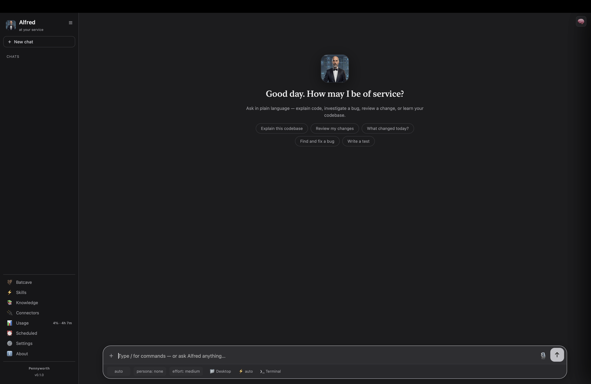

# Getting started

This guide takes you from nothing to a working **Alfred** — the dignified
butler-engineer — running on your own machine in about five minutes.

> You talk to **Alfred**; the open-source project is **Pennyworth**. Alfred is
> the character and the runtime; Pennyworth is the clean core that everything
> platform-specific attaches to through a *pack*.

## 1. Prerequisites

| Requirement | Why | Check |
|-------------|-----|-------|
| **Python 3.11+** | Pennyworth's runtime | `python3 --version` |
| **A host coding agent** | Alfred drives one to do the work — the [Claude Code](https://claude.com/claude-code) CLI by default | `claude --version` |
| **The Claude CLI signed in** | Streaming, models, and the Usage panel read its auth | `claude auth status` |
| **macOS** (for the desktop app) | The app uses pywebview/WebKit; the CLI works anywhere | — |

If `claude` isn't installed, install the Claude Code CLI first (or point
`PENNYWORTH_AGENT` at another agent command — see [configuration](#5-configuration)).

## 2. Install

```bash
pipx install 'pennyworth[app]'     # Alfred, with the desktop app (recommended)
pipx install pennyworth            # command line only, no desktop app
```

From a clone, for development:

```bash
git clone https://github.com/elbazon/pennyworth
cd pennyworth
poetry install --extras app
poetry run alfred --version
```

## 3. First run

**The desktop app** (recommended):

```bash
alfred app          # or, from a clone:  poetry run alfred app
```

A native window opens to the welcome screen. Type a request in plain language —
*"explain this codebase"*, *"review my changes"* — and Alfred replies, streaming
his answer. See the [desktop app tour](desktop-app.md) for every panel.



**The CLI**, for quick one-shots and scripting:

```bash
alfred "explain this repo"     # one-shot, answered in character
alfred chat                    # interactive terminal session
alfred prompt                  # print the assembled system prompt ("the brain")
```

## 4. Tell Alfred who you are

Alfred addresses you properly once he knows your name:

```bash
alfred profile set --name "Ada" --address madam   # sir / madam
alfred profile show
```

In the desktop app this lives under **Settings**. With no profile set, Alfred
falls back to the generic address rule and asks once when unsure.

## 5. Configuration

Everything installs under `PENNYWORTH_HOME` (default `~/.pennyworth`):

```
~/.pennyworth/
  profile.toml            # name + how Alfred addresses you
  app/
    settings.json         # app preferences (model, thinking, font, theme…)
    chats/                # saved conversations
    knowledge.json        # your domain knowledge (see docs/knowledge.md)
    repos.json            # repositories you've added
  themes/                 # custom colour themes
  packs/                  # attached platform packs
```

Useful environment variables:

- `PENNYWORTH_HOME` — relocate all of the above.
- `PENNYWORTH_AGENT` — the host agent command (default `claude`). Point it at any
  agent that speaks the Claude stream-JSON protocol, or a plain command that
  prints a reply.

## 6. Next steps

- **[Desktop app tour](desktop-app.md)** — chat, terminal, models, personas,
  the Batcave, themes, and more.
- **[Teach Alfred your domain](knowledge.md)** — the Knowledge panel: notes that
  get injected into his prompt every turn.
- **[Build a pack](../README.md#build-a-pack)** — make Alfred fluent in *your*
  platform: repositories, team, skills, MCP tools, CI.
- **[Architecture](architecture.md)** — how the brain is assembled and why the
  core stays clean.
