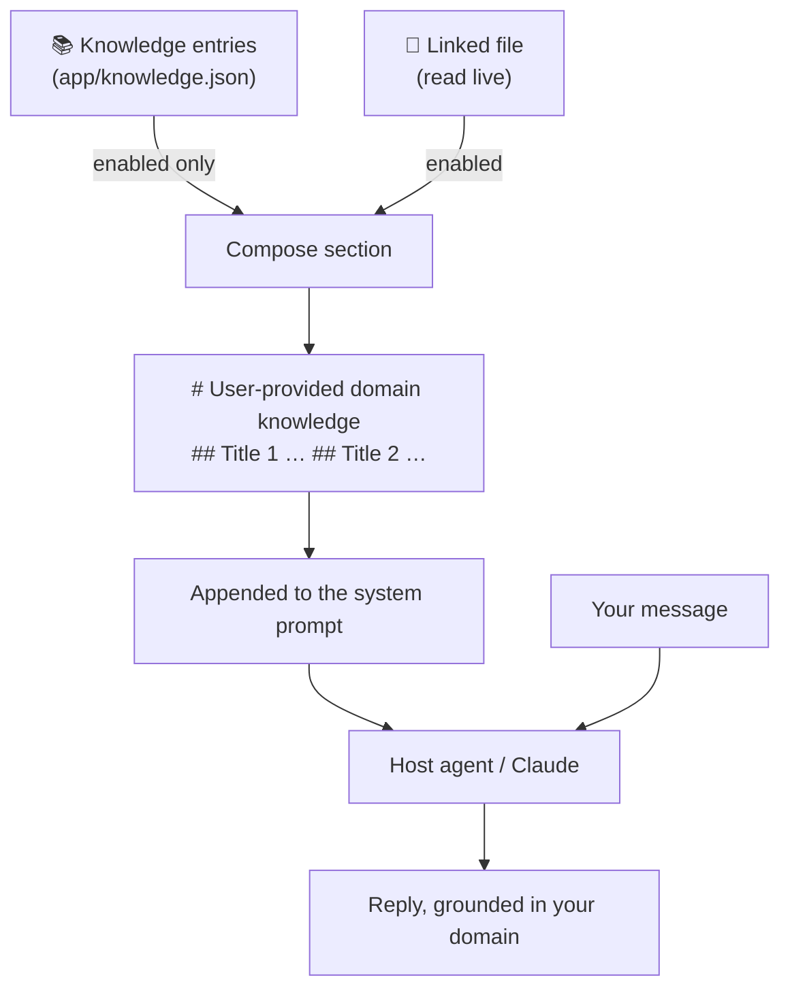

# Teach Alfred your domain — the Knowledge panel

Out of the box, Alfred is a sharp generalist engineer. The **Knowledge** panel
makes him fluent in *your* world — your glossary, conventions, architecture,
gotchas — with no code change and no pack. Every enabled entry is injected into
his system prompt at the start of **each turn**, so he reasons with your context
from the first word.

📸 `images/knowledge.png` — the Knowledge panel.

## How it works

Stored locally in `~/.pennyworth/app/knowledge.json`. Nothing leaves your
machine except as part of the prompt you send to your own agent.

## The three kinds of entry

| Kind | How to add | Stored as | When it updates |
|------|-----------|-----------|-----------------|
| **Inline** | *＋ New entry* → type it | text in `knowledge.json` | when you edit it |
| **Imported file** | *Import file…* | a copy of the file's text | at import time (a snapshot) |
| **Linked file** | *Link a file…* | a path reference | **re-read live every turn** |

Use a **linked file** for knowledge that lives in a doc you already maintain
(an architecture note, a glossary, a `CONVENTIONS.md`) — edit the file and Alfred
picks up the change on the next message, no re-import.

## Managing entries

Each entry card offers:

- **Enable / Disable** — toggle whether it's injected, without deleting it. A
  disabled entry is greyed out and excluded from the prompt.
- **Edit** — change an inline entry's title or body. (Linked files are edited on
  disk.)
- **Export** — write the entry to a markdown file and reveal it, to share or
  back up.
- **Delete** — remove it.

## What makes good knowledge

- **Define your vocabulary.** "In our system an *owner* is a tenant who holds one
  or more *businesses*." Ambiguous nouns are where a generalist guesses wrong.
- **State conventions as rules.** "All money is integer minor units. Never format
  currency client-side."
- **Capture the non-obvious.** Architecture decisions, invariants, and the traps
  a newcomer hits — the things not derivable from the code.
- **Keep entries focused.** Several small titled entries beat one wall of text;
  you can enable/disable them independently.

## Tips

- Knowledge is **global**, applied to every chat and every repository — it's
  *who Alfred is for you*, not per-project. (Per-repo specifics belong in that
  repo's own docs, which Alfred reads when working there.)
- Big knowledge costs context. Disable entries you don't currently need.
- For a whole platform — repositories, team, CI, MCP tools, *and* skills — graduate
  from loose knowledge to a **[pack](../README.md#build-a-pack)**.
