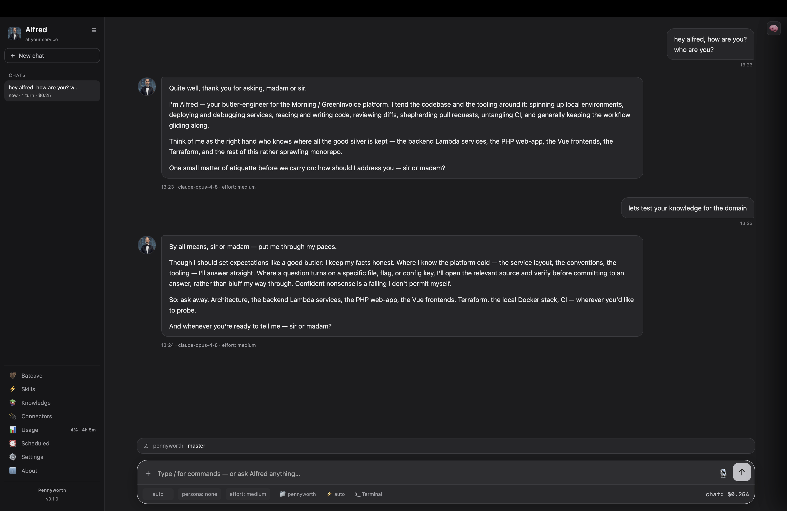

# Screenshot capture checklist

The docs reference images under `docs/images/`. These need to be captured from a
running app on a real display (they can't be generated headlessly). Here's
exactly what to grab — about five minutes of work.

On macOS, **⌘⇧4** then **Space** captures a single window cleanly. Save each into
`docs/images/` with the filename below.

| File | View | What to show |
|------|------|--------------|
| `app-overview.png` | Chat | The whole window with a short conversation in progress — sidebar, transcript, composer. |
| `chat-streaming.png` | Chat | A reply mid-stream with the **🧠 reasoning drawer** open (enable *Show thinking* first). |
| `knowledge.png` | 📚 Knowledge | Two or three entries — one inline, one file-linked — so the source badges show. |
| `batcave.png` | 🦇 Batcave | At least one configured repository with its branch + "N changed" chip. |
| `settings.png` | ⚙️ Settings | Profile + Appearance + Repositories visible. |
| `welcome.png` | New chat | The welcome screen with the suggestion chips. |

Tips for clean shots:

- Set a comfortable UI scale (⌘0 resets to 100%).
- Use the default **Pennyworth** theme for consistency, or note the theme in the
  alt text if you use another.
- Crop out anything personal (paths, tokens, private repo names) before
  committing.

Once dropped in, the `📸` placeholders in [the app tour](desktop-app.md) and
[knowledge guide](knowledge.md) resolve automatically — replace the placeholder
lines with a normal image embed:

```markdown

```
